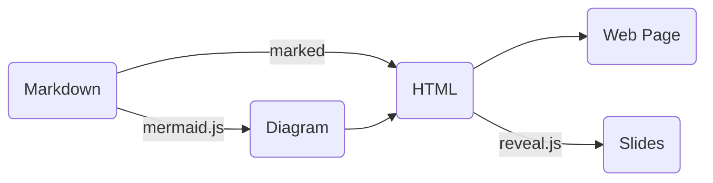

# Documentation as Code

Generate web pages and slides from `Markdown` docs.


## How it Works




## Usage

- Write a doc: `README.md`
- Web page: [`/doc/page.html?file=README`](/doc/page.html?file=README)
- Slides: [`/doc/slides.html?file=README`](/doc/slides.html?file=README)


## Files

```console
$ ls doc/
page.html  README.md  slides.html

$ wc -l doc/*.html
  57 doc/page.html
  63 doc/slides.html
 120 total
```


## Run it on localhost

To run the doc site on your local host, you can use Python's built-in http server.

### In Terminal
```
git clone https://github.com/lzztt/onenow.git

cd onenow/frontend/public
python3 -m http.server 80
```

### In Browser

<http://localhost/doc/page.html>


## Dependencies

- [`marked`](https://marked.js.org/): convert Markdown to a web page
- [`mermaid.js`](https://mermaid.js.org/): render Mermaid diagrams
- [`reveal.js`](https://revealjs.com/): turn the web page into slides
- [`bootstrap`](https://getbootstrap.com/) and [`github-markdown-css`](https://github.com/sindresorhus/github-markdown-css): web page styling
