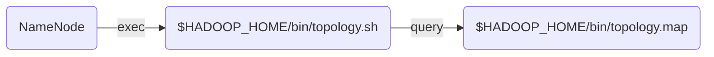

# HDFS Topology Migration


- Background: HBase & HDFS


## HDFS Rack awareness

HDFS block placement will use rack awareness for fault tolerance by placing one block replica on a different rack.


```console
$ hdfs dfsadmin -printTopology
Rack: /rack-1
   192.168.1.1
   192.168.1.2
   192.168.1.3
Rack: /rack-2
   192.168.1.4
   192.168.1.5
   192.168.1.6
Rack: /rack-3
   192.168.1.7
   192.168.1.8
   192.168.1.9
```


## Old Implementation

AWS Placement File

```text
# <EC2 instance ID> <hypervisor ID hash>
i-0d0e2a5c7e5f5b5e  hypervisor-hash-1
i-1d2c3b4a5f6e7d8c  hypervisor-hash-2
i-2a3b4c5d6e7f8g9h  hypervisor-hash-2
i-3f4e5d6c7b8a9a0b  hypervisor-hash-3
i-4b5c6d7e8f9a0f1e  hypervisor-hash-1
i-5e3a9b8f1e2d3c4f  hypervisor-hash-3
```

dumped every 10 minues to files in a `s3` bucket for each `az`


Topology Mapping
`$HADOOP_HOME/bin/topology.map`

Generated from AWS Placement File

```text
<data node IP> <rack location>
192.168.2.101  hypervisor-hash-1
192.168.2.102  hypervisor-hash-2
192.168.2.103  hypervisor-hash-2
192.168.2.104  hypervisor-hash-3
192.168.2.105  hypervisor-hash-1
192.168.2.106  hypervisor-hash-3
```




```console
$ hdfs dfsadmin -printTopology
Rack: /hypervisor-hash-1
   192.168.2.101
   192.168.2.105
Rack: /hypervisor-hash-2
   192.168.2.102
   192.168.2.103
Rack: /hypervisor-hash-3
   192.168.2.104
   192.168.2.106
```


## New Implementation


[AWS Placement Groups](https://docs.aws.amazon.com/AWSEC2/latest/UserGuide/placement-groups.html#placement-groups-strategies)


```python
>>> namespace = 'hbase'
>>> az = 'us-east-1a'

>>> partitions = [f'{namespace}_{az}_{i}' for i in [1,2,3]]
>>> partitions
[
    'hbase_us-east-1a_1',
    'hbase_us-east-1a_2',
    'hbase_us-east-1a_3',
]

>>> racks = partitions
>>> racks
[
    'hbase_us-east-1a_1',
    'hbase_us-east-1a_2',
    'hbase_us-east-1a_3',
]
```

- 3 "Racks" per `az`
- HBase clusters share the same 3 racks


## Migration


If we can merge the data ingestion (mapping generation) path, we don't need to modify the data consumption (query) path.


`$HADOOP_HOME/bin/topology.map` - initial

```text
<data node IP> <rack location>
192.168.2.101  hypervisor-hash-1
192.168.2.102  hypervisor-hash-2
192.168.2.103  hypervisor-hash-2
192.168.2.104  hypervisor-hash-3
192.168.2.105  hypervisor-hash-1
192.168.2.106  hypervisor-hash-3
```


`$HADOOP_HOME/bin/topology.map` - hybrid

```text
<data node IP> <rack location>
192.168.2.101  hypervisor-hash-1
192.168.2.102  hypervisor-hash-2
192.168.2.103  hypervisor-hash-2
192.168.2.104  hypervisor-hash-3
192.168.2.105  hypervisor-hash-1
192.168.2.106  hypervisor-hash-3
192.168.2.107  hbase_us-east-1a_1
192.168.2.108  hbase_us-east-1a_2
192.168.2.109  hbase_us-east-1a_3
192.168.2.110  hbase_us-east-1a_1
192.168.2.111  hbase_us-east-1a_2
192.168.2.112  hbase_us-east-1a_3
```


data migratioin from old hosts to new hosts


`$HADOOP_HOME/bin/topology.map` - final

```text
<data node IP> <rack location>
192.168.2.107  hbase_us-east-1a_1
192.168.2.108  hbase_us-east-1a_2
192.168.2.109  hbase_us-east-1a_3
192.168.2.110  hbase_us-east-1a_1
192.168.2.111  hbase_us-east-1a_2
192.168.2.112  hbase_us-east-1a_3
```


### New host provisitioning

- Create Partition Placement Group for each `AZ`
- Update host provisioning to have Placement Group set


### New topology generation

- Implement mapping generation from Placement Group tag
  - Merge the new mapping into the old `topology.map` file


### Hybrid mode (on standby cluster)

- Release code change to production cluster
- Turn on new topology generation
- Create N new data hosts


### Data migration (on standby cluster)

- stop HBase regionserver serive on old hosts
- exclude old hosts from HDFS
- wait for host state from "Decommissioning" to "Decommissioned"
- Terminate old hosts
- Improve HBase data locality
  - balance regions
  - major compaction


## Benefits

- Eliminated Placement File tech debt
- Reduced host provision time
  - don't need to wait for Placement File generation
- Improved data availibility
  - hosts on different hypervisors might be in the same physical rack (failure domain)
  - Amazon EC2 ensures that each partition within a placement group has its own set of racks. Each rack has its own network and power source.
