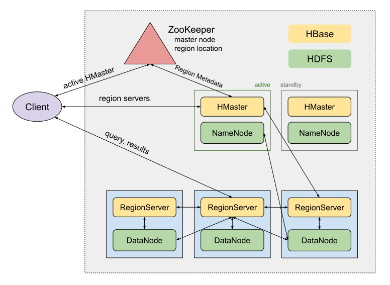

# HDFS Topology Migration


- HDFS and HBase
- HDFS Topology Implementation
  - Placement File
  - Placement Group
- HDFS Topology Migration
- Observability and Automation
- Alternatives, Impacts, and Lessons Learned


What systems were we working on?

## HBase on top of HDFS





## HDFS Topology (Rack Awareness)

Place replicas on different racks


`# of racks >= replication factor`

Improves data availability and locality


But ... \
There is no rack in the cloud?


## Old Topology Implementation

> Let's use a hypervisor as a rack

AWS Placement File

```text
# <EC2 instance ID> <hypervisor ID hash>
i-0d0e2a5c7e5f5b5e  hypervisor-hash-1
i-1d2c3b4a5f6e7d8c  hypervisor-hash-2
i-2a3b4c5d6e7f8g9h  hypervisor-hash-1
i-3f4e5d6c7b8a9a0b  hypervisor-hash-3
i-4b5c6d7e8f9a0f1e  hypervisor-hash-2
```

Files in an `S3` bucket for each `AZ`, updated every 10 minutes


## Topology Generation

`<namenode>:$HADOOP/bin/topology.map`

Based on AWS Placement Files

```text
hostname -> EC2 instance ID -> IP
```

```text
<data node IP> <rack location>
192.168.2.101  hypervisor-hash-1
192.168.2.102  hypervisor-hash-2
192.168.2.103  hypervisor-hash-1
192.168.2.104  hypervisor-hash-3
192.168.2.105  hypervisor-hash-2
```


## Topology Consumption


```console
$ hdfs dfsadmin -printTopology
Rack: /hypervisor-hash-1
   192.168.2.101
   192.168.2.103
Rack: /hypervisor-hash-2
   192.168.2.102
   192.168.2.105
Rack: /hypervisor-hash-3
   192.168.2.104
```


## New Topology Implementation

> Let's use a Placement Group Partition as a rack


```python
>>> namespace = 'hbase'
>>> az = 'us-east-1a'

>>> partitions = [f'{namespace}_{az}_{i}' for i in [1,2,3]]
>>> partitions
[
    'hbase_us-east-1a_1',
    'hbase_us-east-1a_2',
    'hbase_us-east-1a_3',
]

>>> racks = partitions
>>> racks
[
    'hbase_us-east-1a_1',
    'hbase_us-east-1a_2',
    'hbase_us-east-1a_3',
]
```

- 3 "Racks" per `AZ`
- Shared by all HBase clusters


## Topology Migration

- `topology.map`
  - Placement File
  - Placement File + Placement Group
  - Placement Group
- `topology.sh ` doesn't need to change


`$HADOOP/bin/topology.map`

Initial

```text
192.168.2.101  hypervisor-hash-1
...
192.168.2.105  hypervisor-hash-2
```

During migration

```text
192.168.2.101  hypervisor-hash-1
...
192.168.2.105  hypervisor-hash-2
192.168.2.106  hbase_us-east-1a_1
...
192.168.2.110  hbase_us-east-1a_2
```


- data migration from old hosts to new hosts
- decommission old hosts

Final map

```text
192.168.2.106  hbase_us-east-1a_1
192.168.2.107  hbase_us-east-1a_2
192.168.2.108  hbase_us-east-1a_3
192.168.2.109  hbase_us-east-1a_1
192.168.2.110  hbase_us-east-1a_2
```


### Prep Steps

- Create a 3-partition Placement Group for each `AZ`
- Update host provisioning to support placement parameters

```python
  GroupName = "hbase_us-east-1a"
  PartitionNumber = 3  # optional
```

- Implement mapping generation from Placement Group tag


### Data migration (standby cluster)

- Turn on feature flag
- Host Rotation (`batch_size = <N>`)
  - Add new data hosts
  - Stop services on old hosts
    - HBase RegionServer
    - Exclude old hosts from HDFS
  - Wait for host state change
    - `Decommissioning -> Decommissioned`
  - Terminate old hosts
- Improve HBase data locality
  - balance regions, major compaction


## Observability and Automation

New metrics: host distribution

```text
hadoop.hdfs.topology.host_count{cluster="abc",rack="*"}
```

New alert: host imbalance

```text
stdev(
    hadoop.hdfs.topology.host_count{cluster="abc",rack="*"}
) > 1
```

Cluster host balancing automation


## Alternatives

- Placement Group (PG) strategies
  - [Partition vs Cluster vs Spread](https://docs.aws.amazon.com/AWSEC2/latest/UserGuide/placement-groups.html)
- **3-partition shared PG** vs **5-partition cluster PG**
  - 60 clusters would need 60 PGs and 300 partitions
    - Bind cluster names to PG names, cognitive load
    - Implementation complexity
    - High operational load on PG lifecycle
  - HDFS replication factor was 3


- **Reuse existing implementation** vs **a full new topology implementation**
  - Implementation complexity
  - backward compitibility
- **Add new sets of hosts** vs **add existing hosts to PG**
  - Migration speed
    - Rolling stop-move-start operation was slow
  - Implementation complexity
    - Mature host rotation tools and operations
  - Data needs to be moved anyway
  - Data locality operations were needed anyway


## Impacts

- Eliminated Placement File tech debt (AWS requirement)
- Reduced host provisioning time (15 min -> 5 min)
- Improved data availibility
  - hosts on different hypervisors might be in the same physical rack (failure domain)
  - Amazon EC2 ensures that each partition within a placement group has its own set of racks. Each rack has its own network and power source.


## Lessons Learned

- Wrong assumptions cause bugs and delays
  - Failover didn't work on old clusters
  - HMaster overloaded when processing region reassignment
  - Unexpected offline jobs blocked data migration
  - Unhandled topology for external HDFS clients (implementation bug)
  - Cache need to be cleared: topology cache, region cache


## Recent Docs

- [Evolution of Storage](https://onenow.life/doc/page.html?file=storage)
  - [Postmortem](https://onenow.life/doc/page.html?file=postmortem)
- [A Journey to Web Development](https://onenow.life/doc/page.html?file=web)
- [HDFS Topology Migration](https://onenow.life/doc/page.html?file=hdfs)

Open-sourced at [Documentation as Code](https://github.com/lzztt/onenow/tree/main/frontend/public/doc)
