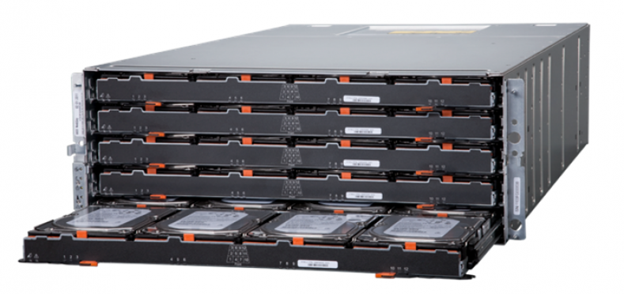
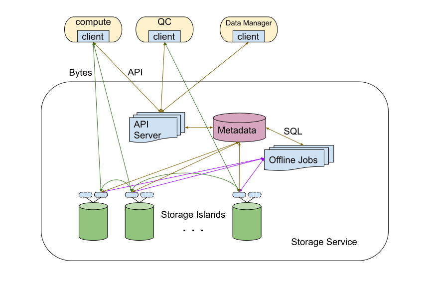
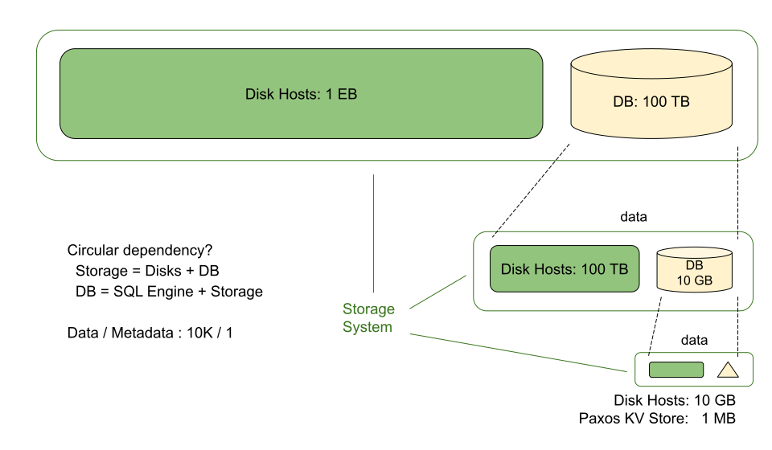

# Evolution of Storage

- Architecture
  - 100 TB - 10 PB (zone)
  - 10 PB - 1 EB (region)
  - 1 EB - cloud storage, cloud DB (globe)
- Observability

> I need to store some data (100 TB)

> OK, 3 Storage Islands

> Data grows to 2 PB

> OK, 60 Storage Islands

## Users are unhappy

- Weekly
  - My Island is slow (`iowait` on hotspot)
  - I forget which Island I put my data on
  - I need to backup my data from one Island to another
- Quatarly
  - My Island is offline
- Annually
  - Data loss after a data center power outage

## Let's build a Storage Service

Constrains

- Stay on-prem
  - Data Processing in the same data center
  - Data Visualization & QC in office next to the data center
- Limited power and space for data center buildings
- No new hardware
  - Utilize existing Storage Islands
  - Move Storage Islands into Storage Service

 Data Characteristics

- Dataset size: 100 GB - 10 TB
- Dataset is split to fixed-size files: 2 GB

In-house Oracle stack

- DB clusters
- DBA team
- Oracle Enterprise Support

Used for

- Job Scheduling System
- Cluster Management System (CPU / GPU)

Client

- API calls
- Data compression & decompression

Offline Jobs

- Data balancing
- Cluster managerment
- Data conversion, compression
- Data backup
- GC of soft deleted data

Problems: metadata in Oracle

- DB hit vertical scaling limit
- DB was SPOF of the Storage Service
- DB failover was never tested
  - eventually failed
- Rebuilding DB indexes took a long time

Similar Distributed Storage Systems

- GFS @ Google
- HDFS of Hadoop

Limits

- 5 million files
- 10 PB data

Bottleneck: GFS Master / HDFS Namenode

## 100X (1 EB regional storage)

Store metadata in a distributed DB

## Cloud Storage & Cloud Database

Blobstore

- a file is split into fixed-size chunks
- chunks are distributed to different chunk files
- chunk files are sealed at 2 GB

Database

- Stateless SQL engine + LSM KV store
- SSTable files are sealed at 2 GB

Store these 2 GB files on regional storage system

## Observability

- Monitoring
  - Black-box
  - White-box
- Events
  - SLO-based alerting (oncall)
  - Maintainence tasks (onduty)
- Four Goldern Signals
  - Latency (success latency, error latency, percentile)
  - Traffic (QPS per API)
  - Errors
  - Saturation (storage capicity runway)
