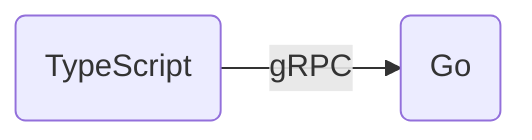

# A Journey to Web Development


## I need a forum


- LAMP on `dev` host

```bash
apt install apache2 mysql-server php
wget http://download.phpbb.com/pub/release/phpBB-3.0.5.zip
```

- Get a domain name

```console
$ whois houstonbbs.com | grep ^Creation
Creation Date: 2009-07-05T07:00:00Z
```

- Shared host


2009: A typical [`phpBB`](https://www.phpbb.com/community/) forum


## I want to customize the home page


First:

- Drupal was so powerful and flexible!

Later:

- Got lost in Drupal modules and themes
- Learned PHP while looking into module hooks

2010: Migrated to a [`Drupal`](https://www.drupal.org/forum) forum


## "Your site uses too much CPU"


"To preserve QoS for our other customers"

```text
NOTICE: Temporary Account Suspension
URGENT: Account Suspension
```

- Moved to a different shared host
- Enabled cache
- Added `robots.txt` file with crawl delay for Web Spiders
- Was asked to upgrade to a more appropriate platform (`VPS`)


## AWS Free Tier


And, I am a Linux Admin


Resources are limited, let me build my own

- [Debian minimal cloud image](https://github.com/lzztt/container/tree/master/linode)
- [nginx](https://github.com/lzztt/container/blob/master/build/build_nginx.sh)
- [php](https://github.com/lzztt/container/blob/master/build/build_php.sh)

2011 - 2014: `LNMP` stack on an EC2 host (500 MB RAM)


## The site is a little slow


- Let me make Drupal faster
  - Drupal is too complex to understand
  - But I just need a simple forum
    - Users can post
    - I can customize
- Let me rewrite the website
  - But try to use the same database (`node` table)
  - Table schemas are too complicated
    - Let me create my own `user` and `node` tables


2012-2013: PHP, JavaScript, CSS

- frontend: [`jQuery` + `Ajax`](https://github.com/lzztt/bbs.backend/blob/8808f9c2012d61d05fd78a04ef7abb7c1b892958/static/themes/default/js/main.js)
- backend: PHP [lib + MVC](https://github.com/lzztt/bbs.backend/tree/8808f9c2012d61d05fd78a04ef7abb7c1b892958) framework
- version control: `svn`
- IDE: NetBeans
- HTML cache: `tmpfs`

Still use Drupal-style node URL: [`http://<domain>/node/192079`](https://www.houstonbbs.com/node/192079)


## Free Tier expired: AWS is expensive


2015: Let me move to Linode


With real SSD, 1 GB RAM


## Let's improve the implementation

rewrite, again and again


Frontend

- 2014: Mobile-first [responsive theme](https://github.com/lzztt/bbs.frontend/tree/a6fec7d21394eed11f2e64c659f400eeb1ba22f6/themes/roselife/css)
- 2014-2015: `Angular v1` single-page [user app](https://github.com/lzztt/bbs.frontend/tree/fb761c7317e94feedeae6f545a7b764659381cdc/app/user.__HEAD__)
- 2016-2020: `mithril` singe-page [user app](https://github.com/lzztt/bbs.frontend/tree/3338104f20dbc6ac73daaea6835c59c3c7362b2a/app/user.__HEAD__)
- 2020: [`React` + `Material UI`](https://github.com/lzztt/bbs.frontend/tree/030549fb7bad932dcca1bfce1fcf1b7ffcbebec2/src) + `Markdown` for all frontend pages


Backend

- 2014: An event-driven [caching system](https://github.com/lzztt/bbs.backend/tree/9ed63933c5f005fd6015c90f5b48be45b12aaf8d/lib/lzx/cache)
- 2014: [ORM](https://github.com/lzztt/bbs.backend/blob/master/server/dbobject/Comment.php) with [field auto-complete](https://github.com/lzztt/bbs.backend/blob/master/server/handler/node/comment/Handler.php#L52-L62)
- 2014: [RESTful APIs](https://github.com/lzztt/bbs.backend/tree/725b6a4b721da651daeff14efc8b64387665c5cb/server/api) for single-user app
- 2014: Anti-spam
- 2015: Upgrade to `PHP 7`, `HTTP/2`, `https`
- 2017: Add [`Composer` and `zend psr7/message`](https://github.com/lzztt/bbs.backend/commit/d80113ba55488e6bd77870eef75bb27bdb55d2c5#diff-f37acfaa6b11f575a9a6f41a75fa73a61d0f8ebc2c9b8cddc215d8aca10e44f5), and [`PHP` type declaration](https://github.com/lzztt/bbs.backend/commit/885f19c95d366f8142da91d9591bfe02e22f26ae)
- 2020: Update to `PHP 8`, add `Redis` (session, rate-limiting, segment cache, backend metrics), remove PHP template rendering


### Lesson Learned

Shouldn't push too much business logic into DB

[stored procedures](https://github.com/lzztt/bbs.database/tree/master/routine): difficult to test and evolve


Favourite Languages

- 2006-2008: Bash, Python
- 2009-2011: Bash, Python, PHP, Java
- 2012-2017: PHP, JavaScript, Python, C++
- 2018-2020: Go, JavaScript, PHP, Python
- 2021-2023: Go, TypeScript, PHP, Python


Recently



[Documentation as Code](https://github.com/lzztt/onenow/tree/main/frontend/public/doc)

[Evolution of Storage](https://onenow.life/doc/page.html?file=storage)

[Postmortem](https://onenow.life/doc/page.html?file=postmortem)
