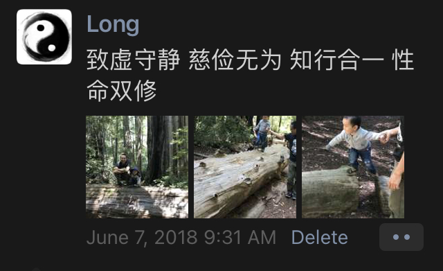

# One Now的由来

我一直想做一个可以自己写东西的网站。

2018年6月，我确定了自己的生活理念：
```
致虚守静 慈俭无为
知行合一 性命双修
```


然后我要取个可以代表自己生活理念的名字。2019年4月确定下来的两个词是：One Now。
```
One：融合简单
Now：活在当下
```

想好后就注册了域名 `onenow.life`。
```
$ whois onenow.life | grep Creation
Creation Date: 2019-04-16T06:28:48Z
```

然后想中文名，想了半天，就叫“一刻生活”吧。展开就是“一心一意，此时此刻”。